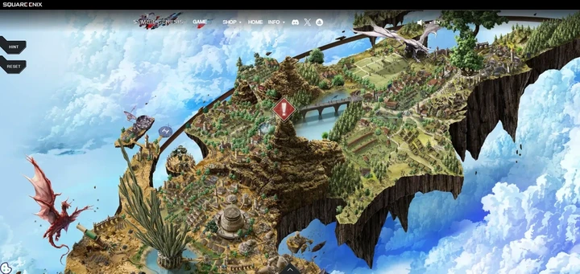
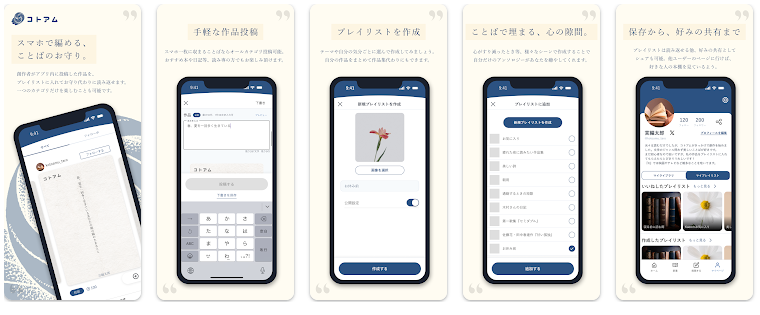

  

  <h1>Hi there, I'm denis g 👋</h1>
  
Passionate Developer | Problem Solver | Tech Enthusiast

---

  

---

## 🚀 Featured Projects

<table>
<tr>
<td width="50%" valign="top">

  
  <h3 style="color: white; margin: 12px 0 8px 0; font-size: 20px;">AliveLand LiveStreaming</h3>
  
<strong>Live streaming application platform</strong>

  
Real-time streaming and interaction

  <a href="https://github.com/gdennis-dev/aliveland-livestreaming" style="color: white; text-decoration: none; font-weight: bold; display: inline-block; margin-top: 12px; padding: 8px 16px; background: rgba(255,255,255,0.25); border-radius: 6px;">🔗 View Project</a>

  
  <h3 style="color: white; margin: 12px 0 8px 0; font-size: 20px;">AI Editor for 3D Modelers</h3>
  
<strong>AI-powered 3D modeling tool</strong>

  
Advanced AI editing capabilities

  <a href="https://github.com/gdennis-dev/ai-editor-3d" style="color: white; text-decoration: none; font-weight: bold; display: inline-block; margin-top: 12px; padding: 8px 16px; background: rgba(255,255,255,0.25); border-radius: 6px;">🔗 View Project</a>

</td>
<td width="50%" valign="top">

  
  <h3 style="color: white; margin: 12px 0 8px 0; font-size: 20px;">SymbioGenesis</h3>
  
<strong>Interactive gaming platform</strong>

  
Web3 gaming ecosystem

  <a href="https://github.com/gdennis-dev/symbiogenesis" style="color: white; text-decoration: none; font-weight: bold; display: inline-block; margin-top: 12px; padding: 8px 16px; background: rgba(255,255,255,0.25); border-radius: 6px;">🔗 View Project</a>

  
  <h3 style="color: white; margin: 12px 0 8px 0; font-size: 20px;">Kotoamu</h3>
  
<strong>Creative digital project</strong>

  
Interactive digital experience

  <a href="https://github.com/gdennis-dev/kotoamu" style="color: white; text-decoration: none; font-weight: bold; display: inline-block; margin-top: 12px; padding: 8px 16px; background: rgba(255,255,255,0.25); border-radius: 6px;">🔗 View Project</a>

</td>
</tr>
</table>

---

## 🛠️ Skills & Technologies

### Programming Languages

  
  
  
  

### Frontend Development

  
  
  
  
  
  

### Backend Development

  
  
  
  
  
  

### Databases

  
  
  
  

### DevOps & Tools

  
  
  
  
  
  

### Other Skills

  
  
  
  

---

## 📫 Connect with Me

  
  
  
  

---

  

---

  
⭐️ From <a href="https://github.com/gdennis-dev">gdennis-dev</a>

  

